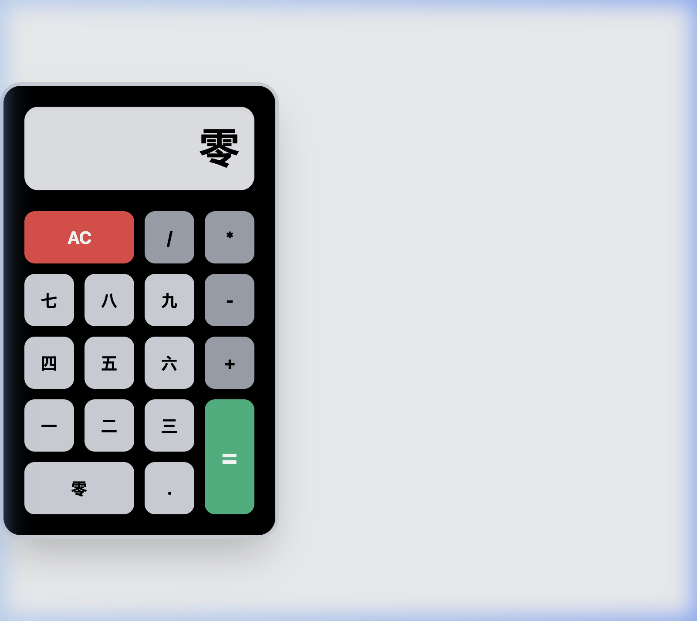

# Devanagari Calculator

A simple calculator single-page application built with React that uses Devanagari numerals. It accepts standard numerical input logic but displays numerals in Devanagari script (e.g., ०, १, २ ... ९).

**Compiled From:** `src/calc.prose`  
**Generated Stack:** React (Create React App), CSS  



## Getting Started

To run the generated application:

```bash
cd generated/calc
npm install
npm start
```
