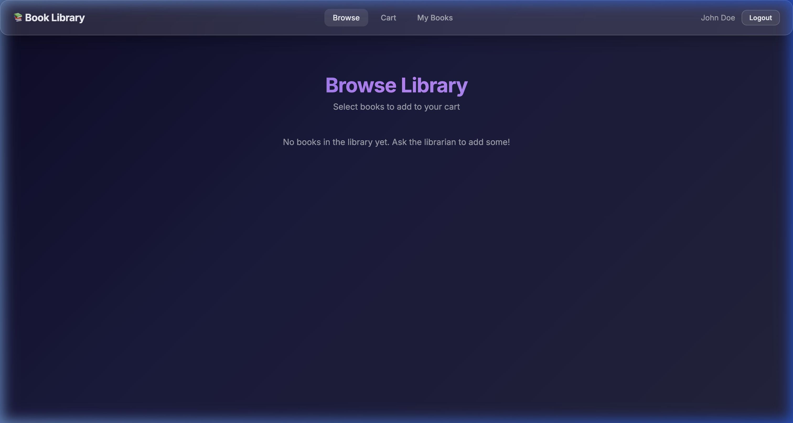
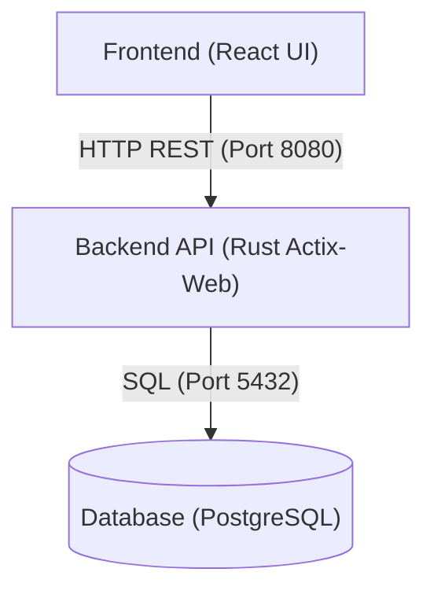

# Full-Stack Book Library

A complete three-tier full-stack application representing a Book Library. It features user authentication, a PostgreSQL database, a Rust (Actix-Web) backend API, and a React frontend UI.

**Compiled From:** `src/full-stack.prose`  
**Generated Stack:** Rust (Backend), React (Frontend), PostgreSQL (Database), Docker Compose  



## Architecture



## Getting Started

To run the full stack application, you need Docker installed.

```bash
cd generated/full-stack
docker compose up --build -d
```

Once all containers are healthy, the UI is accessible at `http://localhost:3000`. 
The backend API listens on port `8080` and the database on `5432`.
