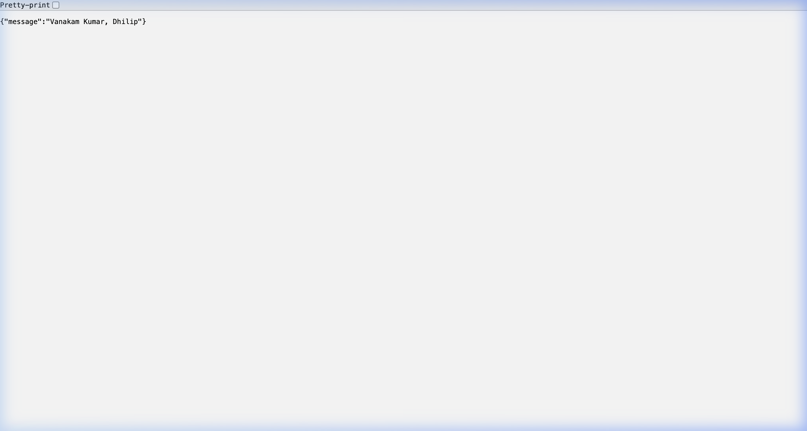

# Hello Microservice (Prose-Lang)

This project contains two implementations of a "Hello" API, generated from `.prose` specifications. It greets users with "Vanakam" and handles name formatting logic.



## Project Structure

- `src/`: Contains the `.prose` design specifications.
- `generated/go/`: Golang implementation (Standard Library).
- `generated/typescript/`: TypeScript implementation (Node.js http).
- `dist/`: Compiled binaries and build artifacts.

---

## Quick Start & Verification

### 1. Golang Implementation

**Run the server:**
```bash
# From the project root
./dist/hello-go
```

**Verify with curl (in a new terminal):**
```bash
# Test with names
curl "http://localhost:8080/hello?First+name=Bob&Last+name=Builder"
# Expected: {"message":"Vanakam Builder, Bob"}

# Test default (missing names)
curl "http://localhost:8080/hello"
# Expected: {"message":"Vanakam World"}
```

### 2. TypeScript Implementation

**Run the server:**
```bash
# From the project root
node dist/typescript/main.js
```

**Verify with curl (in a new terminal):**
```bash
# Test with names
curl "http://localhost:8080/hello?First+name=Bob&Last+name=Builder"
# Expected: {"message":"Vanakam Builder, Bob"}

# Test default (missing names)
curl "http://localhost:8080/hello"
# Expected: {"message":"Vanakam World"}
```

---

## Build & Test Instructions

### Golang
- **Build:** `cd generated/go && go build -o ../../dist/hello-go .`
- **Test:** `cd generated/go && go test ./...`

### TypeScript
- **Build:** `cd generated/typescript && npm run build`
- **Test:** `cd generated/typescript && npm test`
