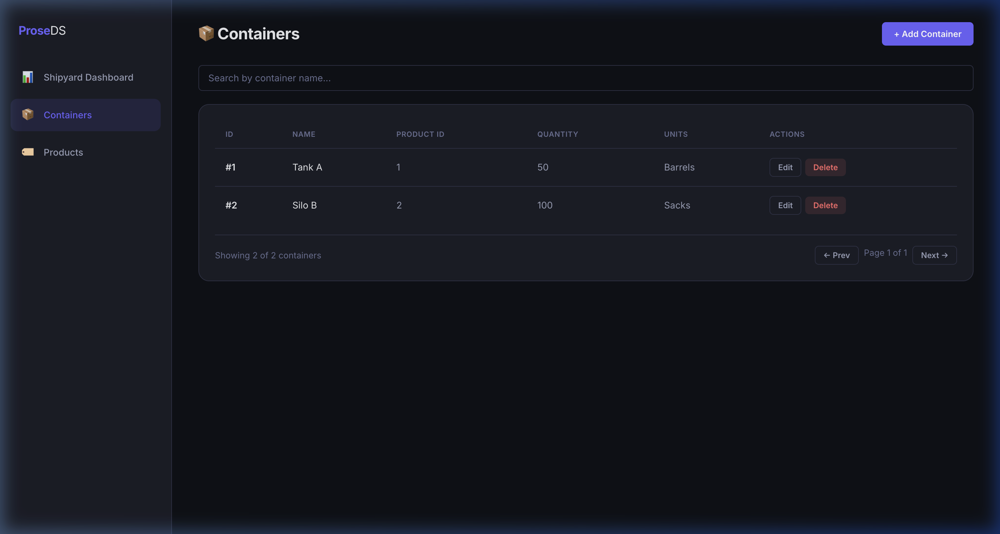

# Microservice Architecture Example

A more complex multi-container application that demonstrates a microservice architecture. It features two independent Java Spring Boot backend services (`m1` for Container Management, `m2` for Product Management) each with their own PostgreSQL database, and a single React frontend proxying requests to both.

**Compiled From:** `src/m1.prose`, `src/m2.prose`, `src/ui.prose`  
**Generated Stack:** Java (Spring Boot), React (Frontend), PostgreSQL (Database), Docker Compose  



## Getting Started

To run the full stack application, you need Docker installed.

```bash
cd generated
docker compose up --build -d
```

Once all containers are healthy, the integrated UI is accessible at `http://localhost:3000`. 

The backends have their own databases running on ports `5433` and `5434`, and their APIs isolated on `8081` and `8082`.
